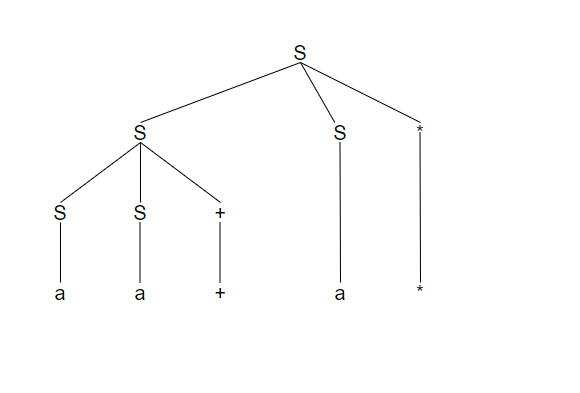
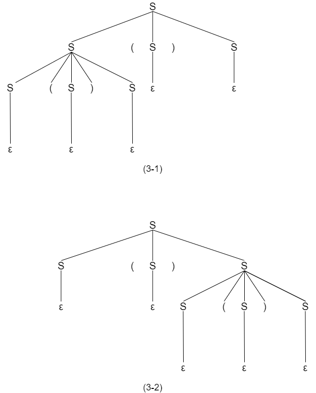
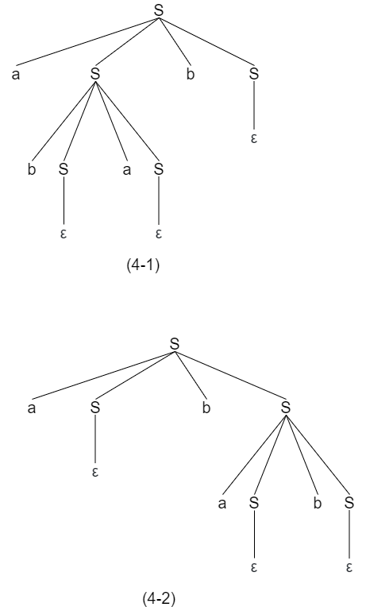
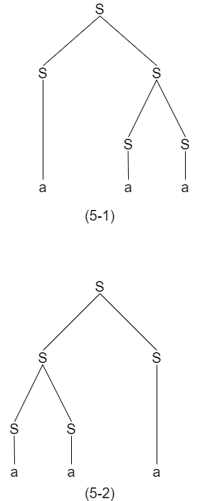

# 第二章 一个简单的语法制导翻译器

## Exercise 2.2.1

考虑下面的上下文无关文法： S->S S + | S S * | a

1) 试说明如何使用该文法生成串aa+a*。
2) 试为这个串构造一棵语法分析树。
3) 该文法生成的语言式什么？证明你的答案。

### 2.2.1.1. Answer

<1> S=> S S *

<2> S=> S S + S *

<3> S=> a a + a *

### 2.2.1.2. Answer



### 2.2.1.3. Answer

由数字、加号和乘号组成的后缀表达式

## Exercise 2.2.2

下面的各个文法生成什么语言？证明你的每一个答案。

1. S->0 S 1 | 0 1
2. S->+ S S | - S S | a
3. S->S ( S ) S | ε
4. S->a S b S | b S a S | ε
5. S->a | S + S | S S | S * | ( S )

### 2.2.2Answer

1. {0<sup>n</sup>1<sup>n</sup> | n>=1}
2. 正负号前缀表达式
3. 匹配任意排列和嵌套的括号，包括ε
4. a和b组成的字符串，个数相同，包括ε
5. 正则表达式

## Exercise 2.2.3

练习2.2.2中哪些文法具有二义性？

### 2.2.3 Answer

1. No
2. No
3. Yes
   
4. Yes
   
5. Yes
   

## Exercise 2.2.4

为下面的各个语言构建无二义性的上下文无关文法。证明你的文法都是正确的。

1. 用后缀方式表示的算数表达式。
2. 由逗号分隔开的左结合的标识符列表。
3. 由逗号分隔开的右结合的标识符列表。
4. 由整数、标识符、四个二目运算符+、-、*、/构成的算数表达式。
5. 在4的运算符中增加单目+和单目-构成的算数表达式。

### 2.2.4 Answer

```
1. E->E E op | num
2. list->list, id | id
3. list->id, list | id
4. expr->expr + term | expr - term | term
   term->term * factor | term / factor | factor
   factor->id | num | (expr)
5. expr->expr + term | expr - term | term
   term->term * unary | term / unary | unary
   unary->+factor | -factor | factor
   factor->id | num | (expr)
```

## Exercise 2.2.5

1. 证明：用下面文法生成的所有二进制串的值都能被3整除。
   num->11 | 1001 | num 0 | num num
2. 上面的文法是否能够生成所有能被3整除的二进制串？

### 2.2.5 Answer

1. 当替换为11时位置集合为n，1101时为m

   sum

    = Σ<sub>n</sub> (2<sup>1</sup> + 2<sup>0</sup>) * 2 <sup>n</sup> + Σ<sub>m</sub> (2<sup>3</sup> + 2<sup>0</sup>) * 2<sup>m</sup>

    = Σ<sub>n</sub> 3 * 2 <sup>n</sup> + Σ<sub>m</sub> 9 * 2<sup>m</sup>

   可见能被3整除。

2. 无法生成10101=21

   ```
    3k = num   -> 11 | 1001 | num 0 | num num
     k = num/3 -> 01 | 0011 | k 0   | k k
     k         -> 01 | 0011 | k 0   | k k
   ```

   21/3 = 7 = 111不存在上面

## Exercise 2.2.6

为罗马数字构建一个上下文无关文法。

### 2.2.6 Answer

romanNum -> thousand hundred ten digit

  thousand -> M | MM | MMM | ε

  hundred -> smallHundred | C D | D smallHundred | C M

  smallHundred -> C | CC | CCC  | ε

  ten -> smallTen | X L | L smallTen | X C

  smallTen -> X | XX | XXX | ε

  digit -> smallDigit | I V | V smallDigit | I X

  smallDigit -> I | II | III  | ε

## Exercise 2.3.1

构建一个语法制导翻译方案，该方案把算数表达式从中缀表达方式翻译成运算符在运算分量之前的前缀表示方式。例如，-xy是表达式x-y的前缀表示法。给出输入9-5+2和9-5*2的注释分析树。

### 2.3.1 Answer

方案:

```
expr -> expr + term
      | expr - term
      | term
term -> term * factor
      | term / factor
      | factor
factor -> digit | (expr)
```

注释分析树:

```
expr -> {print("+")} expr + term
      | {print("-")} expr - term
      | term
term -> {print("*")} term * factor
      | {print("/")} term / factor
      | factor
factor -> digit {print(digit)}
        | (expr)
```

## Exercise 2.3.2

构建一个语法制导翻译方案，该方案将算术表达式从后缀表示方式翻译成中缀表示方式。给出输入95-2*和952*-的注释分析树。

### 2.3.2 Answer

方案:

```
expr -> expr expr +
      | expr expr -
      | expr expr *
      | expr expr /
      | digit
```

注释分析树:

```
expr -> expr {print("+")} expr +
      | expr {print("-")} expr -
      | {print("(")} expr {print(")*(")} expr {print(")")} *
      | {print("(")} expr {print(")/(")} expr {print(")")} /
      | digit {print(digit)}
```

#### Another reference answer

```
E -> {print("(")} E {print(op)} E {print(")"}} op | digit {print(digit)}
```

## Exercise 2.3.3

构建一个将整数翻译成罗马数字的语法制导翻译方案。

### 2.3.3 Answer

辅助函数:

```
repeat(sign, times) // repeat('a',2) = 'aa'
```

翻译制导方案:

```
num -> thousand hundred ten digit
       { num.roman = thousand.roman || hundred.roman || ten.roman || digit.roman;
         print(num.roman)}
thousand -> low {thousand.roman = repeat('M', low.v)}
hundred -> low {hundred.roman = repeat('C', low.v)}
         | 4 {hundred.roman = 'CD'}
         | high {hundred.roman = 'D' || repeat('X', high.v - 5)}
         | 9 {hundred.roman = 'CM'}
ten -> low {ten.roman = repeat('X', low.v)}
     | 4 {ten.roman = 'XL'}
     | high {ten.roman = 'L' || repeat('X', high.v - 5)}
     | 9 {ten.roman = 'XC'}
digit -> low {digit.roman = repeat('I', low.v)}
       | 4 {digit.roman = 'IV'}
       | high {digit.roman = 'V' || repeat('I', high.v - 5)}
       | 9 {digit.roman = 'IX'}
low -> 0 {low.v = 0}
     | 1 {low.v = 1}
     | 2 {low.v = 2}
     | 3 {low.v = 3}
high -> 5 {high.v = 5}
      | 6 {high.v = 6}
      | 7 {high.v = 7}
      | 8 {high.v = 8}
```

## Exercise 2.3.4

构建一个将罗马数字翻译成整数的语法制导翻译方案。

### 2.3.4 Answer

方案：

```
romanNum -> thousand hundred ten digit
thousand -> M | MM | MMM | ε
hundred -> smallHundred | C D | D smallHundred | C M
smallHundred -> C | CC | CCC | ε
ten -> smallTen | X L | L smallTen | X C
smallTen -> X | XX | XXX  | ε
digit -> smallDigit | I V | V smallDigit | I X
smallDigit -> I | II | III | ε
```

翻译制导方案：

```
romanNum -> thousand hundred ten digit {romanNum.v = thousand.v || hundred.v || ten.v || digit.v; print(romanNun.v)}
thousand -> M {thousand.v = 1}
          | MM {thousand.v = 2}
          | MMM {thousand.v = 3}
          | ε {thousand.v = 0}
hundred -> smallHundred {hundred.v = smallHundred.v}
         | C D {hundred.v = smallHundred.v}
         | D smallHundred {hundred.v = 5 + smallHundred.v}
         | C M {hundred.v = 9}
smallHundred -> C {smallHundred.v = 1}
              | CC {smallHundred.v = 2}
              | CCC {smallHundred.v = 3}
              | ε {hundred.v = 0}
ten -> smallTen {ten.v = smallTen.v}
     | X L  {ten.v = 4}
     | L smallTen  {ten.v = 5 + smallTen.v}
     | X C  {ten.v = 9}
smallTen -> X {smallTen.v = 1}
          | XX {smallTen.v = 2}
          | XXX {smallTen.v = 3}
          | ε {smallTen.v = 0}
digit -> smallDigit {digit.v = smallDigit.v}
       | I V  {digit.v = 4}
       | V smallDigit  {digit.v = 5 + smallDigit.v}
       | I X  {digit.v = 9}
 smallDigit -> I {smallDigit.v = 1}
            | II {smallDigit.v = 2}
            | III {smallDigit.v = 3}
            | ε {smallDigit.v = 0}
```

## Exercise 2.3.5

构建一个将后缀算数表达式翻译成等价的前缀算数表达式的语法制导翻译方案。

### 2.3.5 Answer

方案:

```
expr -> expr expr op | digit
```

翻译制导方案:

```
expr -> {print(op)} expr expr op | digit {print(digit)}
```

## Exercise 2.4.1

为下列文法构造递归下降语法分析器：

1. S->+ S S | - S S | a
2. S->S ( S ) S | ε
3. S->0 S 1 | 0 1

### 2.4.1 Answer

1. [2_4_1_1](./src/2_4_1_1.c)
2. [2_4_1_2](./src/2_4_1_2.c)
3. [2_4_1_3](./src/2_4_1_3.c)
