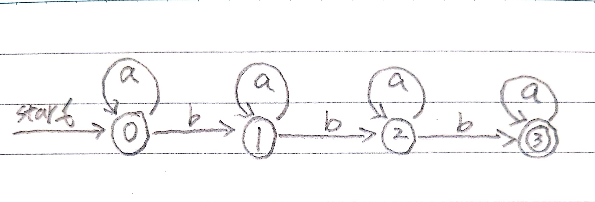

# 第三章 词法分析

## Exercise 3.1.1

将下面的C++程序

```c++
float limitedSquare(x) {
  float x;
  /* returns x-squared, but never more than 100 */
  return (x <= -10.0 || x >= 10.0) ? 100 : x * x;
}
```

划分为正确的词素序列。哪些词素应该有相关联的词法值？应该具有什么值？

### 3.1.1 Answer

```g4
<float> <id, limitedSquare> <(> <id, x> <)> <{>
  <float> <id, x>
  <return> <(> <id, x> <op, "<="> <num, -10.0> <op, "||"> <id, x> <op, ">="> <num, 10.0> <)> <op, "?"> <num, 100> <op, ":"> <id, x> <op, "*"> <id, x>
<}>
```

## Exercise 3.1.2

像HTML或XML之类的标记语言不同于传统的程序设计语言，它们要么包含有很多标点符号（标记）， 如HTML，要么使用用户自定义的标记集合，如XML。而且标记还可以带有参数。请指出如何把下面的HTML文档

```html
Her is a photo of <B>my house</B>;
<P><BR>
See <A HREF = "morePix.html">More Pictures</A> if you
liked that one.<P>
```

划分为适当的词素序列。哪些词素应该具有相关联的词法值？应该具有什么样的值？

### 3.1.2 Answer

```g4
<text, "Here is a photo of"> <nodestart, b> <text, "my house"> <nodeend, b>
<nodestart, p> <selfnode, img> <selfnode, br>
<text, "See"> <nodestart, a> <text, "More Pictures"> <nodeend, a>
<text, "if you liked that one."> <nodeend, p>
```

## Exercise 3.3.1

对于下列各个语言，查询语言使用手册以确定：

(i)形成各语言的输入字母表的字符集分别是什么（不包括那些只能出现在字符串或注释中的字符）？
(ii)各语言的数字常量的词法形式是什么？
(iii)各语言的标识符的词法形式是什么？

(1) C (2) C++ (3) C# (4) Fortran (5) Java (6) Lisp (7) SQL

### 3.3.1 Answer

(1)(2)(3)(5)

ASCII

```lex
digit -> 0|1|...|9

digits -> digit digit*

optionalFraction -> . digits | ε

optionalExponent -> (E(+|-|ε) digits) | ε

number -> digits optionalFraction optionalExponent

```

```lex
letter_ -> A|B|...|Z|a|b|...|z|_

digit -> 0|1|...|9

id -> letter_(letter_|digit)*
```

## Exercise 3.2.2

试描述下列正则表达式定义的语言：

1) a(a|b)*a
2) ((ε|a)b*)*
3) (a|b)*a(a|b)(a|b)
4) a*ba*ba*ba*
5) (aa|bb)*((ab|ba)(aa|bb)*(ab|ba)(aa|bb)*)*

### Answer 3.2.2

1) 字符串a开头a结尾，中间0个或者多个a或者b
2) 多个a和多个b组成的字符串
3) 多个a和多个b组成的字符串，倒数第三个是a
4) 多个a和多个b组成的字符串，其中b只出现3次
5) 多个a和多个b组成的字符串，其中a和b都出现偶数次

## Exercise 3.3.3

试说明在一个长度为n的字符串中，分别有多少个

1) 前缀
2) 后缀
3) 真前缀
4) 子串
5) 子序列

### Answer 3.3.3

1) n+1
2) n+1
3) n-1
4) C(n+1,2)+1
5) Σ(i=0,n) C(n, i)

## Exercise 3.3.5

写出下列语言的正则定义：

1) 包含5个元音的所有小写字母，这些串中的元音按顺序出现
2) 所有由按字典递增序列排列的小写字母组成的串
3) 注释，即\/\*和\*\/之间的串，且串中没有不在双引号(\")中的\*\/。
4) 所有不重复的数位组成的串。
5) 所有最多只有一个重复数位的串。
6) 所有由偶数个a和奇数个b构成的串。
7) 以非正式方式表示的国际象棋的步法的集合，如p - k4或kbp x qn。
8) 所有由a和b组成并且不含子串abb的串。
9) 所有由a和b组成且不含子序列abb的串。

### Answer 3.3.5

1)

```lex
other -> [bcdfghjklmnpqrstvwxyz]

want -> other*a (other|a)* e (other|e)* i(other|i)* o(other|o)* u(other|u)*
```

2)

```lex
a*b*...z*
```

3)

```lex
\/\*([^*"]*|".*"|\*+[^/])*\*\/
```

4)

```lex
A -> 0?2(02)*

want -> 0|A?0?1(A0?1|01)*A?0?|A0?
```

5)

```lex
E -> b(aa)*b

F -> a(aa)*b

G -> b(aa)*ab|a

F -> ba(aa)*b

want -> (FE*G|(aa)*b)(E|FE*G)
```

6)

```lex
even_a_even_b -> (aa|bb)*((ab|ba)(aa|bb)*(ab|ba)(aa|bb)*)*

even_a_odd_b -> b even_a_even_b | a(aa|bb)*(ab|ba) even_a_even_b
```

8)

```lex
b*(a+b?)*
```

9)

```lex
b*|b*a+|b*a+ba*
```

## Exercise 3.3.6

为下列的字符集合写出对应的字符类。

1) 英文字母的前10个字母(从a~j)，包括大小写。
2) 所有小写的辅音字母的集合。
3) 十六进制中的“数位”（对大于9的数位，自己决定大写或小写）
4) 可以出现在一个合法的英语句子后面的字符集（比如感叹号）。

### Answer 3.3.6

1) [a-jA-J]
2) [bcdfghjklmnpqrstvwxyz]
3) [0-9a-f]
4) [.?!]

## Exercise 3.3.7

请注意这些正则表达式中的下列字符（称为运算符字符）都具有特殊的含义：

```lex
\ " . ^ $ [ ] * + ? { } | /
```

如果想要使得这些特殊字符在一个串中表示它们自身，就必须取消它们的特殊含义。我们将它们放在一个长度大于等于1且加上双引号的串中就可以取消特殊含义。例如，正则表达式"\**\"和字符串**匹配。我们也可以在一个运算符字符前加一个反斜杠，得到这个字符的字面含义。那么，正则表达式\\\*\\\*也可以和串\*\*匹配。请写出一个和字符串"\匹配的正则表达式。

### Answer 3.3.7

```lex
\"\\
```

## Exercise 3.3.8

在Lex中，补集字符串(complemented character class)代表该字符串中列出的字符之外的所有字符。我们将^放在开头来表示一个补集字符类。除非^在该字符类内列出，否则这个字符不在被取补的字符类中。因此，[^A-Za-z]匹配所有不是大小写字母的字符，[^\^]匹配除^(以及换行符，因为它不在任何字符类中)之外的任何字符。试证明：对于每个带有补集字符类的表达式，都存在一个等价的不含补集字符类的表达式。

### Answer 3.3.8

假设表达式^A不存在不带有补集字符类的表达式A，那对于^A取补集^^A，则有^^A包含A，和假设不符。

## Exercise 3.3.9

正则表达式r{m,n}和模式r的m到n次重复出现相匹配。例如a{1,5}和由1~5个a组成的串匹配。试证明：对于每一个包含这种形式的重复运算符的正则表达式，都存在一个等价的不包含重复运算符的正则表达式。

### Answer 3.3.9

r{m,n}等价于r.(m).r | r.(m + 1).r | ... | r.(n).r

## Exercise 3.3.10

运算符^匹配一行的最左端，$匹配一行的最右端。运算符^也被用作补集字符类的首字符，但是通过上下文总是能够确定它的含义。例如，^[^aeiou]*$匹配任何一个不包含小写原因字符的行。

1) 你怎样判断^到底表示哪一个意思？
2) 是否总是能够将一个包含^和$运算符的正则表达式替换为一个等价的不包含这些运算符的正则表达式？

### Answer 3.3.10

1) 如果^在中括号内并且是第一个字符，那么就意味着是补集，其他情况就是匹配最左端。
2) 不能，比如^\^$

## Exercise 3.3.11

UNIX的shell命令sh在文件名表达式中使用如下的运算符来描述文件名的集合。例如，文件名表达式*.o和所有以.o结束的文件名匹配；sort1.?和所有形如sort1.c的文件名匹配，其中c可以是任意字符。试问如何使用只包含并、连接和闭包运算符的正则表达式来表示sh文件名表达式？

| 表达式 | 匹配 | 例子 |
|-----|--------|-----|
| 's' | 串s的字面值 | '\\' |
| \c | 字符c的字面值 | \\' |
| * | 任何串 | *.o |
| ? | 任何字符 | sort1.? |
| [s] | s中的任何字符 | sort1.[cso] |

## Exercise 3.3.12

SQL语言支持一种不成熟的模式扫描方式，其中有两个具有特殊含义的字符；下划线(_)表示任意一个字符；百分号%表示包含0个或多个字符的串。此外，程序员还可以将任意一个字符(比如e)定义为转义字符。那么，在_、%或者另一个e之前加上一个e，就使得这个字符只表示它的字面值。假设我们已经知道哪个字符是转义字符，说明如何将任意SQL模式表示为一个正则表达式。

## Exercise 3.4.1

给出识别练习3.3.2中各个正则表达式所描述的语言的状态转换图。

### Answer 3.4.1

1) a(a|b)\*a

DFA:

| NFA | DFA | a | b |
|-----|-----|---|---|
| {0} | A | B | |
| {1,2,3,5,8} | B | C | D |
| {2,3,4,5,7,8,9} | C | C | D |
| {2,3,5,6,7,8} | D | C | D |


2) ((ε|a)b\*)\*


3) (a|b)\*a(a|b)(a|b)


4) a\*ba\*ba\*ba\*



5) (aa|bb)\*((ab|ba)(aa|bb)\*(ab|ba)(aa|bb)\*)\*


## Exercise 3.4.2

给出识别练习3.3.5中各个正则表达式所描述的语言的状态转换图。

### Answer 3.4.2

1)


2)


## Exersice 3.4.3

构造下列串的失效函数

1) abababaab

2) aaaaaa

3) abbaabb

### Answer 3.4.3

1) [0, 0, 1, 2, 3, 4, 5, 1, 2]

2) [0, 1, 2, 3, 4, 5]

3) [0, 0, 0, 1, 1, 2, 3]

## Exercise 3.4.4

对s进行归纳，证明图3-19算法正确的计算出了失效函数。

```c
t = 0;
f(1) = 0;
for (s = 1; s < n; s++) {
  while (t > 0 && b_s+1 != b_t+1) t = f(t);
  if (b_s+1 == b_t+1) {
    t = t + 1;
    f(s + 1) = t;
  } else {
    f(s + 1) = 0;
  }
}
```

### Answer 3.4.4

1) 已知f(1) = 0

2) 在第1次for循环时，计算f(2)的值，当第5行的代码b_2 == b_1成立时，代码进入到第7行得出f(2)=1，不成立时，则代码进入第9行得出f(2)=0。显然，这次循环正确的计算出了f(2)。

3) 假设在第i-1进入循环时，也正确的计算出了f(i)，也有f(i)=t(无论t是大于0还是等于0)

4) 那么在第i次进入循环时，分两种情况进行考虑：

  i. t==0

  这种情况比较简单，直接从第5行开始，当b_i+1==b_1时，f(i+1)=1，否则f(i+1)=0

  ii. t>0 while循环会不断缩小t值，试图找出最大可能的使得b_i+1==b_t+1成立的t值，如果找到了，则进入第5行执行，得到f(i+1)=t+1；或者直到t==0时也没有找到，则跳出循环，这时进入第5行执行，过程类似于前一种情况。

## Exercise 3.4.5

说明图 3-19 中的第 4 行的复制语句 t = f(t) 最多被执行 n 次。进而说明整个算法的时间复杂度是 O(n)，其中 n 是关键字长度。

### Answer 3.4.5

参考前期[ARTS中的KMP](https://github.com/milley/ARTS/blob/master/week04/share/KMP%E7%AE%97%E6%B3%95.md)

## Exercise 3.4.6

应用KMP算法判断关键字ababaa是否为下面字符串的子串：

1) abababaab

2) abababbaa

### Answer 3.4.6

1) true

2) false

## Exercise 3.4.7

说明下面的算法可以正确的指出输入关键字是否为一个给定的字符串的子串。提示：对i进行归纳。说明对于所有的i，在第四行运行后s的值是那些既是a_1a_2...a_i的后缀又是该关键字的前缀的字符串中最长字符串的长度。

```c
s = 0;
for (i = 1; i <= m; i++) {
  while (s > 0 && a_i != b_s+1) s = f(s);
  if (a_i == b_s+1) s = s + 1;
  if (s == n) return "yes";
}
return "no";
```

### Answer 3.4.7

详见3.4.5解答。

## Exercise 3.4.8

假设已经计算得到函数f且它的值存储在一个以s为下标的数组中，说明上面算法的复杂度为O(m+n)。

### Answer 3.4.8

详见3.4.5解答。

## Exercise 3.4.9

Fibonacci字符串的定义如下：

1) S_1 = b

2) S_2 = a

3) 当k>2时，S_k = S_k-1S_k-2

假如，S_3=ab,S_4=aba,S_5=abaab。

1) S_n的长度是多少？

2) 构造S_6的失效函数。

3) 构造S_7的失效函数。

4) 说明任何 sn 的失效函数都可以被表示为：f(1) = f(2) = 0，且对于 2 < j <= |sn|, f(j) = j - |sk-1|，其中 k 是使得 |sk| <= j + 1 的最大整数。

5) 在 KMP 算法中，当我们试图确定关键字 sk 是否出现在字符串 sk+1 中，最多会连续多少次调用失效函数？

### Answer 3.4.9

1) 参见[维基百科](http://zh.wikipedia.org/wiki/%E6%96%90%E6%B3%A2%E9%82%A3%E5%A5%91%E6%95%B0%E5%88%97)

2) [abaababa]

3) [abaababaabaab]

## Exercise 3.5.1

描述如何对图3-23中的Lex程序作出如下修改：

1) 增加关键字while

2) 将比较运算符变成C语言中的同类运算符

3) 允许把下划线当做一个附加的字母

4) 增加一个新的具有词法单元STRING的模式。该模式由一个双引号(")、任意字符串以及结尾处的一个双引号组成。但是，如果一个双引号出现在上述串中，那么它的前面必须加上一个反斜线(\)进行转义处理，因此在该字符串中的反斜线将用双反斜线表示。这个词法单元的词法值是去掉了双引号的字符串，并且其中用于转义的反斜线已经被删除。识别得到的字符串将被存放到一个字符串表中。

### Answer 3.5.1

[代码](./src/answer/lex.l)

## Exercise 3.5.2

编写一个Lex程序。该程序拷贝一个文件，并将文件中每个非空的空白符序列替换为单个空格。

## Exercise 3.5.3

编写一个Lex程序。该程序拷贝一个C程序，并将程序中关键字float的每个实例替换成double。

## Exercise 3.5.4

编写一个Lex程序。该程序把一个文件改变成"Pig latin"文。明确的讲，假设该文件是一个用空白符分隔开的单词（即字母串）序列。每当你遇到一个单词时：

1) 如果第一个字母是辅音字母，则将它移到单词的结尾，并加上ay。

2) 如果第一个字母是元音字母，则只在单词的结尾加上ay。

所有非字母的字符不加处理直接拷贝到输出。

### Answer 3.5.4

[代码](./src/answer/lex2.l)

## Exercise 3.5.5

在SQL中，关键字和标识符都是大小写不敏感的。编写一个Lex程序，该程序识别（大小写字母任意组合）关键字SELECT、FROM、和WHERE以及词法单元ID。考虑到这个练习的目的，你可以把ID看成是任何一个字母开头、由字母和数位组成的字符串。你不必将标识符存放到一个符号表中，但需要指出这里的"install"函数与图3-23中用于描述大小写敏感标识符的函数有何不同。

### Answer 3.5.5

[代码](./src/answer/lex3.l)

## Exercise 3.6.1

3.4节的练习中的图3-19计算了KMP算法的失效函数。说明在已知失效函数的情况下，如何根据已知的关键字b_1b_2...b_n，构造出一个具有n+1个状态的DFA，该DFA可以识别语言*b_1b_2...b_n（其中，点代表任意字符）。更进一步，证明构造这个DFA的时间复杂度是O(n)。

### Answer 3.6.1


伪代码如下：

```pseudo
for (i = 0; i < n; i++) {
  move[s[i], c] = {
    if (c == b_1b_2...b_n[i]) {
      goto s[i+1]
    } else {
      goto s[f(i)]
    }
  }
}
```

时间复杂度为O(n)。

## Exercise 3.6.2

为练习3.3.5中的每一个语言设计一个DFA或NFA。

## Exercise 3.6.3

找出图3-29所示的NFA中所有标号为aabb的路径。这个NFA接受aabb吗？

### Answer 3.6.3

- (0) -a-> (1) -a-> (2) -b-> (2) -b-> ((3))
- (0) -a-> (0) -a-> (0) -b-> (0) -b-> (0)
- (0) -a-> (0) -a-> (1) -b-> (1) -b-> (1)
- (0) -a-> (1) -a-> (1) -b-> (1) -b-> (1)
- (0) -a-> (1) -a-> (2) -b-> (2) -b-> (2)
- (0) -a-> (1) -a-> (2) -b-> (2) -ε-> (0) -b-> (0)
- (0) -a-> (1) -a-> (2) -ε-> (0) -b-> (0) -b-> (0)

这个NFA接受aabb。

## Exercise 3.6.4

对图3-30的NFA，重复练习3.6.3。

## Exercise 3.6.5

给出如下练习中的NFA的转换表：

1) 练习3.6.3。

2) 练习3.6.4。

3) 图3-26。

### Answer 3.6.5

1)

| state | a | b | ε |
|-----|-----|-----|-|
| 0 | {0,1} | {0} | ∅ |
| 1 | {1,2} | {1} | ∅ |
| 2 | {2} | {2,3} | {0} |
| 3 | ∅ | ∅ | ∅ |

2)

| state | a | b | ε |
|-----|-----|-----|-|
| 0 | {1} | ∅ | {3} |
| 1 | ∅ | {2} | {0} |
| 2 | ∅ | {3} | {1} |
| 3 | {0} | ∅ | {2} |

3)

| state | a | b | ε |
|-----|-----|-----|-|
| 0 | ∅ | ∅ | {1,2} |
| 1 | {2} | ∅ | ∅ |
| 2 | {2} | ∅ | ∅ |
| 3 | ∅ | {4} | ∅ |
| 4 | ∅ | {4} | ∅ |